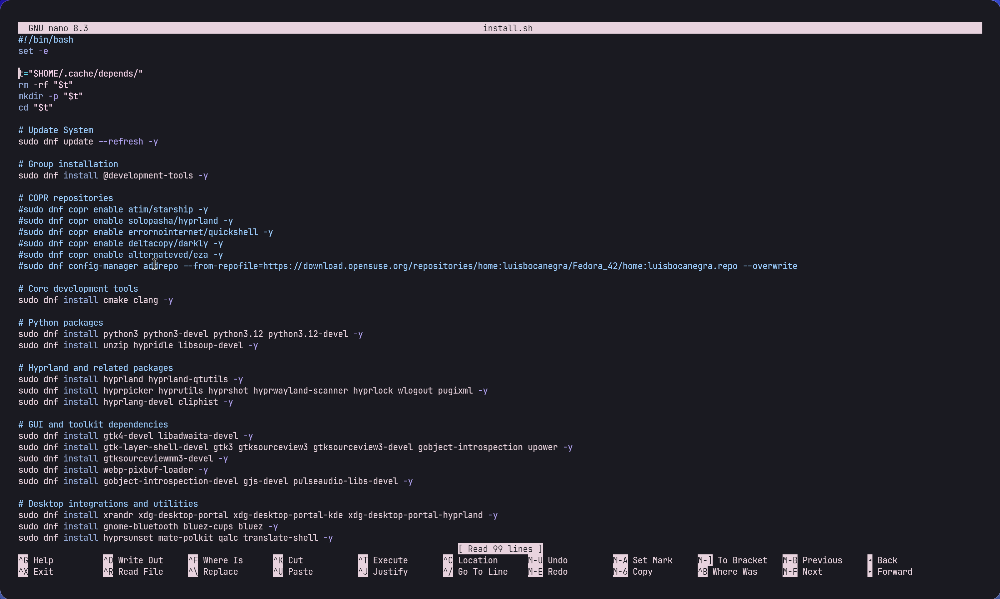

# end4dots-asahi-arm64

Instructions for running End4 Dots on Asahi Linux (ARM64). This guide provides step-by-step instructions for setting up a customized Hyprland environment on Asahi Linux Fedora KDE variant.

## System Requirements

- Apple Silicon Mac (M1/M2 series)
- Minimum 32GB storage space
- 8GB RAM recommended
- Working internet connection

## Tested Configuration

- Device: MacBook Pro (14-inch, M1 Pro, 2021)
- OS: Fedora Linux Asahi Remix 42
- Kernel: Linux 6.16.4-402.asahi.fc42.aarch64
- Display: 3024x1890 @ 60Hz
- WM: Hyprland 0.51.0 (Wayland)


*End4Dots running on Asahi Linux*

## Prerequisites

- Asahi Linux Fedora KDE variant installed on your Apple Silicon Mac
- Basic knowledge of terminal commands
- Git installed

## Installation Steps

### 1. Initial Setup

1. Install Asahi Linux Fedora KDE variant on your device
2. Clone the required repository:
   ```bash
   git clone https://github.com/EisregenHaha/fedora-hyprland.git
   cd fedora-hyprland
   ```

3. Copy configuration files:
   ```bash
   cp -r .local .config fedora/
   cd fedora
   ```


*File structure after copying*

### 2. Enable Required Repositories

Run these commands manually (ignore any errors):

```bash
sudo dnf copr enable atim/starship -y
sudo dnf copr enable solopasha/hyprland -y
sudo dnf copr enable errornointernet/quickshell -y
sudo dnf copr enable deltacopy/darkly -y
sudo dnf copr enable alternateved/eza -y
sudo dnf config-manager addrepo --from-repofile=https://download.opensuse.org/repositories/home:luisbocanegra/Fedora_42/home:luisbocanegra.repo --overwrite
```

### 3. Script Modifications

1. Remove the repository enabling commands from `install.sh` (the ones we just ran manually)
2. Modify the installation commands in the script:

   Add `--skip-unavailable` to this line:
   ```bash
   sudo dnf install gnome-themes-extra adw-gtk3-theme qt5ct qt6ct qt6-qtwayland kcmshell6 qt5-qtwayland fontconfig jetbrains-mono-fonts gdouros-symbola-fonts lato-fonts darkly fish kitty starship -y --skip-unavailable
   ```

   Add `--skip-broken` to this line:
   ```bash
   sudo dnf install -y --allowerasing python-opencv plasma-desktop plasma-nm kdialog bluedevil plasma-systemmonitor wtype matugen quickshell-git grimblast kde-material-you-colors mpvpaper ffmpeg --skip-broken
   ```


*Modified install.sh script*

### 4. Manual Package Building

Some packages need to be built manually:

#### Building kde-material-you-colors

```bash
# Clone the repository
git clone https://github.com/luisbocanegra/kde-material-you-colors.git
cd kde-material-you-colors

# Install build dependencies
python3 -m pip install --user build

# Build the package
python3 -m build --wheel --outdir dist

# Install the built wheel (choose one of the following options)
# For current user only:
python3 -m pip install --user dist/*.whl
# For system-wide installation:
sudo python3 -m pip install dist/*.whl

# Verify installation
kde-material-you-colors --help
```

#### Building darkly

```bash
# Clone the repository
git clone --single-branch --depth=1 https://github.com/Bali10050/Darkly.git
cd Darkly

# Install build dependencies
sudo dnf install -y \
  qt5-qtbase-devel \
  qt5-qtsvg-devel \
  qt5-qttools-devel \
  kf5-kcoreaddons-devel \
  kf5-kconfig-devel \
  kf5-kconfigwidgets-devel \
  kf5-kguiaddons-devel \
  kf5-ki18n-devel \
  kf5-kiconthemes-devel \
  kf5-kirigami2-devel \
  kf5-kwayland-devel \
  kf5-kwindowsystem-devel \
  kf5-frameworkintegration-devel \
  extra-cmake-modules \
  kf5-kcmutils

# Build and install the package
./install.sh QT5
```


*Screenshot placeholder: Successful manual package builds*

### 5. Final Installation

Run the installation script:
```bash
./fedora.sh
```

> **Note**: If you encounter issues during the microtex build stage, install missing packages by searching for them with '-devel' suffix in Fedora's repositories.

## Troubleshooting

If you encounter any build errors during the microtex stage, try installing the development packages. In Fedora, these packages typically end with `-devel`. For example:
- If `foo` is missing, try: `sudo dnf install foo-devel`


*Screenshot placeholder: Common error resolution*

## Expected Result

After successful installation, you should have:
- Hyprland 0.51.0 or later running on Wayland
- Full hardware acceleration support
- Working battery management
- Functional WiFi and Bluetooth
- Custom terminal configuration with Fish shell and JetBrains Mono font
- Material You-based theming


*End4Dots running on MacBook Pro with full hardware support*
